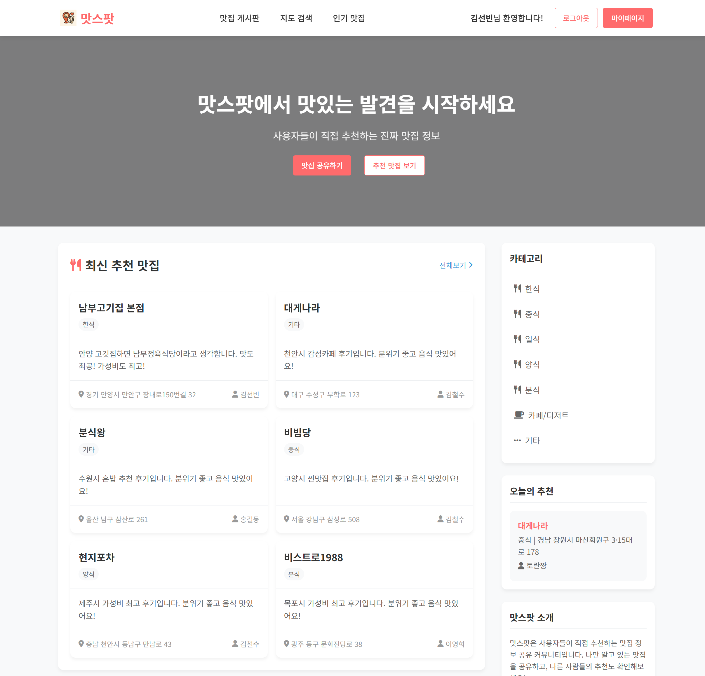
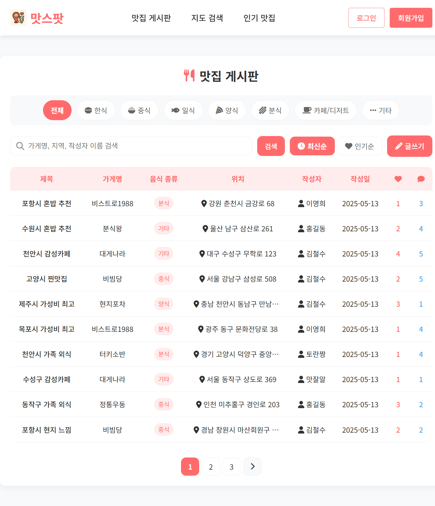
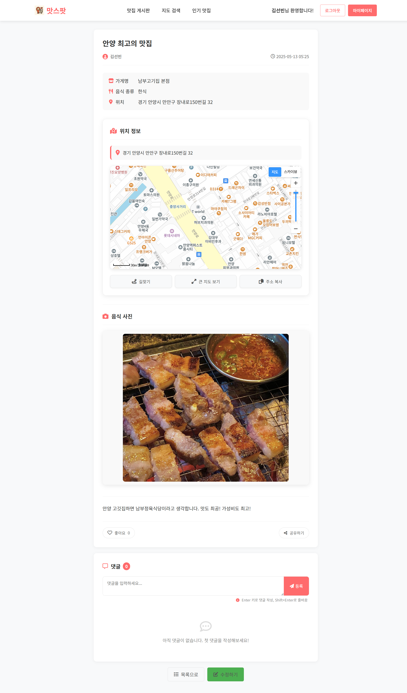
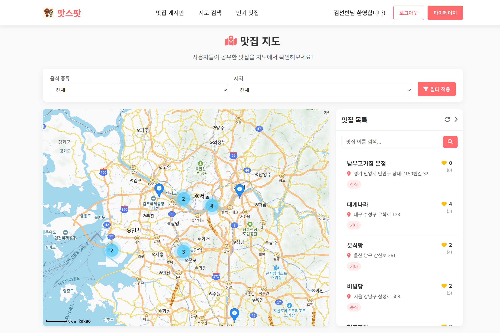
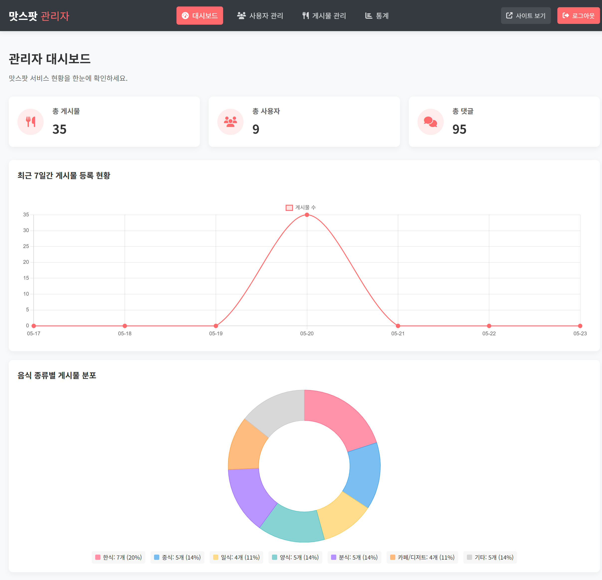

# 안양대학교 웹&앱 프로젝트
## 프로젝트 주제
### 맛집 추천 커뮤니티(맛스팟)
사용자가 직접 맛집 정보를 공유하고, 다른 사람들의 추천 맛집을 찾아볼 수 있는 웹 기반 커뮤니티 서비스  
회원가입을 통해 사용자 인증, 게시판을 통해 맛집 후기와 추천 내용을 자유롭게 작성/수정/삭제 가능  
각 게시물에는 맛집 위치, 음식 종류, 가게 이름, 추천 이유 등을 함께 등록

## 주요 기능
- **맛집 정보 공유**: 사용자가 직접 맛집 후기와 추천 정보 작성
- **지도 기반 검색**: 카카오 지도 API를 활용한 맛집 위치 표시 및 검색
- **지도 클러스터링**: 사용자들이 작성한 맛집 게시글의 위치를 지도에 표시하고, 가까운 위치의 맛집들을 클러스터로 그룹화하여 효율적인 탐색 제공
- **커뮤니티 기능**: 좋아요, 댓글을 통한 사용자 간 소통
- **이메일 인증**: SMTP를 통한 회원가입 이메일 인증 시스템
- **고급 검색**: 음식 종류, 지역별 필터링 검색 기능
- **관리자 시스템**: 게시물, 사용자, 통계 관리 기능
- **반응형 디자인**: 모바일과 데스크톱에서 최적화된 사용자 경험
- **이미지 업로드**: 맛집 사진 첨부 기능

## 개발 환경 (Development Environment)
- IDE: Eclipse IDE
- Java version: 21.0.4
- Web Framework: JSP / Servlet
- Application Server: Apache Tomcat 10.1
- Database: MySQL 8.0
- JDBC Driver: mysql-connector-j-9.2.0.jar

## 사용 기술 스택 (Tech Stack)
### Frontend
- HTML, CSS, JavaScript
- Chart.js (통계 차트 시각화)
- 카카오 지도 API (지도 서비스)

### Backend
- Java Servlet & JSP
- MySQL Database
- SMTP (이메일 발송)
- Jakarta Mail API
- JSTL (JSP Standard Tag Library)

### External APIs
- 카카오 지도 API (지도 서비스)
- Gmail SMTP (이메일 발송)

## 환경 설정

### 1. 데이터베이스 설정
1. MySQL 데이터베이스 생성 및 사용자 설정
2. `Database/matjip.sql` 파일을 사용하여 데이터베이스 스키마 생성

### 2. 환경 변수 설정
1. `Source/WebContent/WEB-INF/config.example.properties` 파일을 `config.properties`로 복사
2. `config.properties` 파일에서 다음 값들을 실제 값으로 수정:
   ```properties
   # 데이터베이스 설정
   db.host=localhost
   db.port=3307
   db.name=MatJip
   db.username=root
   db.password=your_database_password
   
   # 이메일 설정 (Gmail)
   email.address=your_email@gmail.com
   email.password=your_app_password
   
   # 카카오 지도 API
   kakao.map.api.key=your_kakao_map_api_key
   
   # 관리자 계정
   admin.id=your_admin_id
   admin.password=your_admin_password
   ```

### 3. Gmail 앱 비밀번호 설정
1. Google 계정 설정에서 2단계 인증 활성화
2. 앱 비밀번호 생성 (16자리 코드)
3. 생성된 앱 비밀번호를 `email.password`에 입력

### 4. 카카오 지도 API 키 설정
1. [카카오 개발자 콘솔](https://developers.kakao.com/)에서 애플리케이션 생성
2. 플랫폼 설정에서 Web 플랫폼 추가
3. JavaScript 키를 `kakao.map.api.key`에 입력

### 5. 관리자 계정 설정
1. `admin.id`에 관리자 아이디 설정
2. `admin.password`에 관리자 비밀번호 설정
3. 기본값: admin / 1234 (보안을 위해 반드시 변경 권장)

## 실행 방법

### Eclipse IDE
1. Eclipse IDE에서 프로젝트 import
2. Apache Tomcat 10.1 서버 설정
3. 프로젝트를 서버에 추가
4. 서버 실행

### IntelliJ IDEA
1. IntelliJ IDEA에서 프로젝트 열기
2. Tomcat 서버 설정
3. Artifact 설정 (WAR 파일)
4. 서버 실행

## VSCode 실행 방법(Servlet 안 됨)
VSCode에서 3가지 확장 프로그램 설치
1. Java Server Pages
2. Debugger for Java
3. Tomcat for Java

WorkSpace에서 Tomcat Servers 클릭 후<br/>
"+" 클릭, Tomcat 폴더를 추가<br/>
Tomcat 서버 우클릭 후 Open Server Configuration 선택<br/>
``<Host>음

#### 메인 페이지

프로젝트 소개 및 인기 맛집 표시

#### 게시판

맛집 목록, 검색, 필터링 기능

#### 게시물 상세

맛집 상세 정보 및 댓글 기능

#### 지도 검색

카카오 지도 API를 활용한 위치 기반 검색 및 클러스터링

#### 관리자 대시보드

Chart.js를 활용한 통계 시각화 및 관리 기능

### 사용자 플로우
1. 회원가입 → 이메일 인증 → 로그인
2. 맛집 검색 → 게시물 작성 → 지도에 위치 표시
3. 다른 사용자 게시물 조회 → 좋아요/댓글 작성
4. 마이페이지에서 프로필 관리
